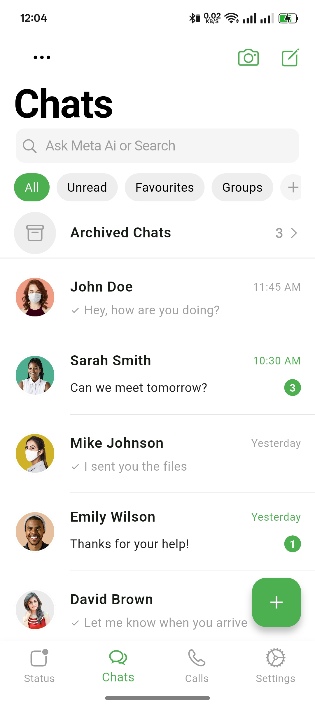
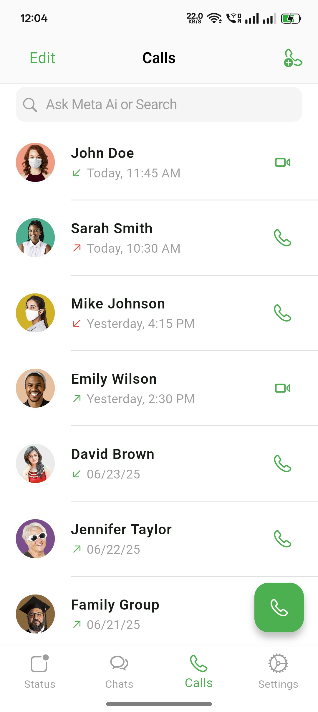
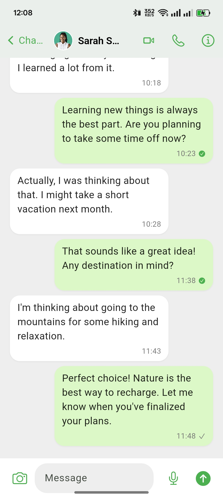

# WhatsApp Clone - iOS Style

<div align="center">
  
  
  
  
</div>

<div align="center">
  <p>A modern WhatsApp clone with iOS-inspired design built using Flutter.</p>
</div>

## 📱 Overview

This project is a feature-rich WhatsApp clone that recreates the elegant iOS style WhatsApp interface. It features a collapsible app bar, seamless navigation, and sleek animations to provide an authentic messaging experience.

### Key Features

- **🔍 Collapsible App Bar**: Smooth transition with title scaling and seamless search functionality
- **💬 Chat List**: Complete with unread indicators, time stamps, and message preview
- **📞 Call History**: Track incoming, outgoing, and missed calls
- **📊 Status Updates**: View and share status updates with contacts
- **👤 Contact Management**: Browse and search through your contact list
- **⚙️ Settings**: Customize your messaging experience

## 🖼️ Screenshots

<div align="center">
  <table>
    <tr>
      <td align="center"><strong>Chats</strong></td>
      <td align="center"><strong>Calls</strong></td>
      <td align="center"><strong>Chat Detail</strong></td>
    </tr>
    <tr>
      <td></td>
      <td></td>
      <td></td>
    </tr>
  </table>
</div>

## 🛠️ Technical Implementation

- **Architecture**: Service-based navigation pattern for clean separation of concerns
- **Data Management**: JSON-driven data model for chats and calls
- **UI Components**:
  - Custom SliverAppBar implementation for collapsible headers
  - iOS-styled widgets following Apple Human Interface Guidelines
  - Hero animations for smooth transitions
- **Performance Optimizations**: Efficient list rendering with optimized assets

## 🚀 Getting Started

### Prerequisites

- Flutter SDK (3.19 or higher)
- Dart (3.8.1 or higher)
- iOS simulator or Android emulator / device

### Installation

1. Clone the repository:
   ```bash
   git clone https://github.com/yourusername/whatsapp_clone.git
   cd whatsapp_clone
   ```

2. Install dependencies:
   ```bash
   flutter pub get
   ```

3. Run the app:
   ```bash
   flutter run
   ```

### Folder Structure

```
lib/
├── models/            # Data models for chats, calls, etc.
├── navigation/        # Navigation service and routes
├── utils/            # Utility functions and helpers
├── widgets/          # Reusable UI components
└── screens/          # App screens
```

## 📝 Future Enhancements

- [ ] Dark mode support
- [ ] End-to-end encryption simulation
- [ ] Voice and video calling functionality
- [ ] Media sharing capabilities
- [ ] Group chat features
- [ ] Cloud sync for messages

## 👨‍💻 Contributing

Contributions are welcome! Please feel free to submit a Pull Request.

1. Fork the repository
2. Create your feature branch (`git checkout -b feature/amazing-feature`)
3. Commit your changes (`git commit -m 'Add some amazing feature'`)
4. Push to the branch (`git push origin feature/amazing-feature`)
5. Open a Pull Request

## 📄 License

This project is licensed under the MIT License - see the [LICENSE](LICENSE) file for details.

## 🙏 Acknowledgements

- [Flutter](https://flutter.dev/) for the amazing framework
- [Cupertino Icons](https://pub.dev/packages/cupertino_icons) for iOS-style icons
- [WhatsApp](https://www.whatsapp.com/) for design inspiration

---

<div align="center">
  <p>Developed with ❤️ by Your Name</p>
  <p>This is a personal project for educational purposes and not affiliated with WhatsApp Inc.</p>
</div>
